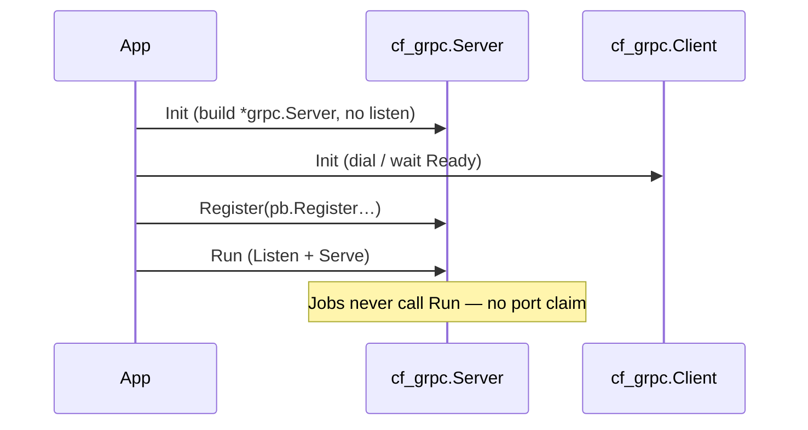

# caerus-framework-grpc

[](https://github.com/caerus-framework/caerus-framework-grpc/actions/workflows/ci.yml)
[](https://codecov.io/gh/caerus-framework/caerus-framework-grpc)
[](LICENSE)

Caerus Framework gRPC transport component.

This module owns **dial, listen, reconnect, and lifecycle** for gRPC. It does
**not** know your generated service types. Product apps import their own
protobuf stubs (from a separate APIs / genproto module) and:

- **Server:** `Register` services on the framework `*grpc.Server` (like
  `cf_http.SetHandler`), then the component `Run` listens.
- **Client:** keep the `*cf_grpc.Client` peer and build stubs from
  `Conn()` (a live facade that survives config reload).

Several servers and several clients in one process use `WithServerName` /
`WithClientName` the same way multiple `cf_postgres` or `cf_valkey` peers use
`WithName`.

## Wiring

Two wiring shapes. Prefer the **app-owned** golden path.

### App-owned consumer (golden)

`main` declares chassis (including gRPC server and/or client instances) and
the app class. The app resolves peers at `Init`, lists them in
`GetDependencies`, registers services / builds stubs.

```go
fw := cf.New(&cf.FrameworkOptions{
	Logs: &cf.LogsSettings{Format: "json", Level: "info", ConfigSource: "logs"},
	Observability: &cf.ObservabilitySettings{Bind: ":9090", ConfigSource: "observability"},
	Components: []cf.CaerusComponent{
		cf_postgres.New(cf_postgres.WithConfigSource("postgresql", "config/postgresql.json")),
		cf_grpc.NewServer(
			cf_grpc.WithServerName("grpc-public"),
			cf_grpc.WithServerConfigSource("grpc-public", "config/grpc-public.json"),
		),
		cf_grpc.NewClient(
			cf_grpc.WithClientName("auth"),
			cf_grpc.WithClientConfigSource("grpc-auth", "config/grpc-auth.json"),
		),
		app.New(app.Options{}),
	},
})
if err := fw.RunWithSignals(context.Background()); err != nil {
	log.Fatal(err)
}
```

```go
type App struct {
	grpcSrv  *cf_grpc.Server
	authPeer *cf_grpc.Client
	auth     authpb.AuthServiceClient // generated stub
}

func (a *App) GetDependencies() []string {
	return []string{"grpc-public", "auth", cf_logs.ComponentName}
}

func (a *App) Init(ctx context.Context, fw *cf.CaerusFramework) error {
	srv, ok := cf.GetByName[*cf_grpc.Server](fw, "grpc-public")
	if !ok {
		return errors.New("app: grpc-public missing")
	}
	cli, ok := cf.GetByName[*cf_grpc.Client](fw, "auth")
	if !ok {
		return errors.New("app: auth grpc client missing")
	}
	a.grpcSrv = srv
	a.authPeer = cli
	a.auth = authpb.NewAuthServiceClient(cli.Conn()) // or cf_grpc.Stub(cli, authpb.NewAuthServiceClient)

	srv.Register(func(g *grpc.Server) {
		authpb.RegisterAuthServiceServer(g, a) // a implements the service
	})
	return nil
}
```

**Two different names:** component `Name()` (`"auth"`, `"grpc-public"`) is
what `GetDependencies` / `GetByName` use. The configuration **source** name
(`"grpc-auth"`, `"grpc-public"`) is what appears in files, env prefixes, and
`--grpc-auth` path overrides. Prefer matching them when you can.

### Simple `main`-level wiring

```go
logs := cf_logs.New(cf_logs.WithWriter(os.Stdout))
srv := cf_grpc.NewServer(cf_grpc.WithBind(":9099"))
cli := cf_grpc.NewClient(cf_grpc.WithTarget("127.0.0.1:9099"))
fw := cf.New(&cf.FrameworkOptions{Components: []cf.CaerusComponent{logs, srv, cli}})
```

## Lifecycle (listen only in Run)



Wrong: `Init` calls `net.Listen`. Right: `Init` prepares; `Run` binds.

## Configuration

One **source per instance** (not one file with maps of all peers).

Env overlay uses the source’s prefix (default from source name:
`grpc-auth` → `GRPC_AUTH_`). File path override: `--grpc-auth`.

### Server settings (`ServerConfig`)

| Setting | Kind | Default | Meaning |
| --- | --- | --- | --- |
| `bind` | setting | `:9090` | Listen address (`host:port`). Claimed only in `Run`, never in `Init`. |
| `shutdown_timeout_sec` | tunable | `10` | How long `GracefulStop` may take before hard `Stop`. |
| `keepalive_time_sec` | tunable | `7200` (2h) | Server keepalive ping period (gRPC `ServerParameters.Time`). |
| `keepalive_timeout_sec` | tunable | `20` | Wait for keepalive ping ack before closing the connection. |
| `max_connection_idle_sec` | tunable | `900` (15m) | Close connections idle longer than this (gRPC `MaxConnectionIdle`). |
| `restart_policy` | setting | `handled` | What happens if `bind` changes on reload: `handled` (log “restart required”, keep current listener) or `immediate` (`Run` returns so the process can exit and rebind). **No live rebind.** |

Example `config/grpc-public.json`:

```json
{
  "bind": ":9099",
  "shutdown_timeout_sec": 10,
  "restart_policy": "handled"
}
```

### Client settings (`ClientConfig`)

| Setting | Kind | Default | Meaning |
| --- | --- | --- | --- |
| `target` | setting | _(required)_ | Dial target (`host:port` or `dns:///name:port`). |
| `insecure` | switch | `true` | Use insecure credentials (v1; TLS files not implemented yet). |
| `connect_timeout_sec` | tunable | `5` | How long `Init` waits for connectivity `Ready`. |
| `keepalive_time_sec` | tunable | `10` | Client keepalive ping period when idle. |
| `keepalive_timeout_sec` | tunable | `1` | Wait for keepalive ping ack. |
| `degraded_mode` | switch | `false` | When true, failed dial / Ready wait does **not** abort `Init` (hard-fail when off). Same idea as `cf_valkey`. |
| `health_when_degraded` | setting | `not_ready` | While disconnected under DegradedMode: `not_ready` (`Health` fails → `/readyz` 503) or `ready` (break-glass LB traffic). |

Example — local process (laptop / `go run`):

```json
{
  "target": "127.0.0.1:9099",
  "insecure": true,
  "connect_timeout_sec": 5,
  "degraded_mode": false,
  "health_when_degraded": "not_ready"
}
```

Example — in-cluster peer (Kubernetes Service in the **same namespace**; cluster
DNS short name resolves to that Service’s ClusterIP):

```json
{
  "target": "peer-api:9099",
  "insecure": true,
  "connect_timeout_sec": 5,
  "degraded_mode": false,
  "health_when_degraded": "not_ready"
}
```

Same Service from another namespace uses the FQDN form instead, e.g.
`peer-api.tenant-a.svc.cluster.local:9099`.

Client **DegradedMode** matches
[`caerus-framework-valkey`](https://github.com/caerus-framework/caerus-framework-valkey)
(`cf_valkey`): Init may succeed without Ready; `/readyz` stays red unless
`health_when_degraded: ready`.

## Options (construct-time)

| Option | Applies to | Meaning |
| --- | --- | --- |
| `WithServerConfig` / `WithClientConfig` | both | static snapshot |
| `WithServerConfigSource` / `WithClientConfigSource` | both | self-registered source |
| `WithBind` / `WithTarget` | server / client | listen or dial address |
| `WithServerName` / `WithClientName` | both | component `Name()` |
| `WithServerLogger` / `WithClientLogger` | both | explicit logger |
| `WithClientDegradedMode` | client | soft Init on dial failure |
| `WithConnectTimeout` | client | Ready wait |
| `WithShutdownTimeout` | server | GracefulStop deadline |

## Proto / generated stubs

Not in this module. Apps depend on a published APIs / genproto Go module for
`.proto`-generated clients and servers. Wire those stubs in app `Init`
(`Register` on the server; `NewXxxClient(cli.Conn())` on the client).
